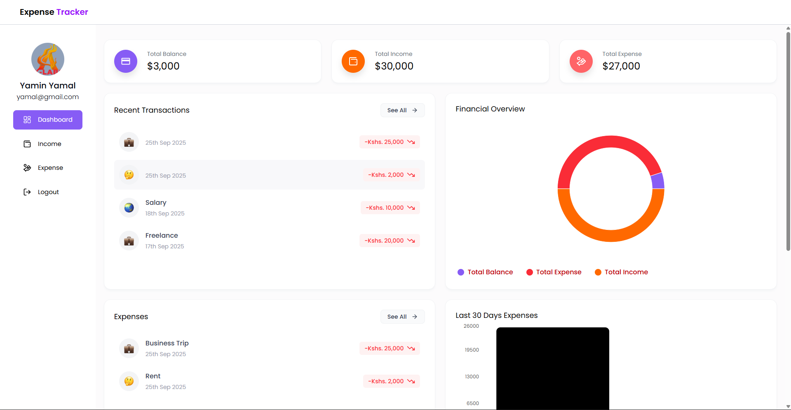
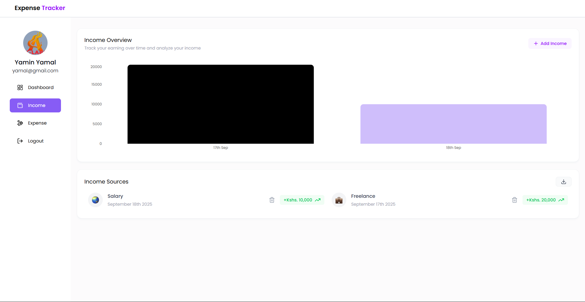
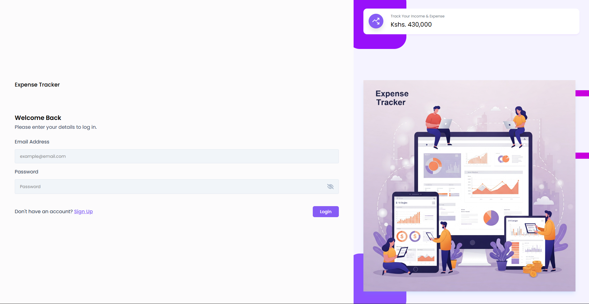
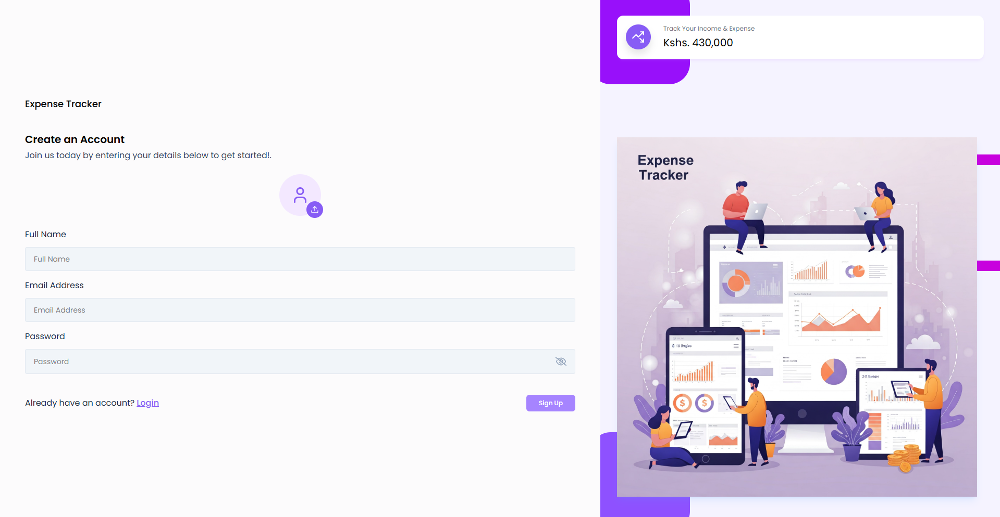

# MERN Expense Tracker

An interactive web app for tracking income and expenses, built with the MERN stack (MongoDB, Express, React, Node).  
Users can add, view, edit, and delete transactions (income/expense), see summaries, and analyze their financial data.

## 📸 Screenshots

Here are a few screenshots of the app in action:
<p align="center">
  <table>
    <tr>
      <td width="50%">
        
      </td>
      <td width="50%">
        
      </td>
    </tr>
    <tr>
      <td width="50%">
        
      </td>
      <td width="50%">
        
      </td>
    </tr>
  </table>
</p>

---

## 🧰 Features

- **User authentication**: Sign up, login, logout  
- **Manage transactions**: Add, delete, edit income and expense entries  
- **Real-time summary**: View total income vs total expenses  
- **Responsive UI**: Works well on desktop and mobile  
- **Detailed views**: Filter or view transaction history  
- **Validation & error handling**: Backend and frontend checks  

---

## ⚙️ Tech Stack

```sh
| Tier | Technology |
|------|------------|
| Frontend | React, Tailwind, Redux |
| Backend | Node.js, Express.js |
| Database | MongoDB (Atlas or local) |
| Auth & Security | JWT or session based (depending on implementation), input validation |
| Environment | `.env` for storing secrets, keys |
````
---


---

## 🚀 Getting Started

### 1. Prerequisites
- Node.js & npm installed  
- MongoDB instance (local or cloud)

### 2. Environment Variables
Create a `.env` file in the **backend** folder with:
```bash
MONGO_URI=your_mongodb_connection_string
JWT_SECRET=your_jwt_secret
PORT=8000     # or whichever port your backend uses
CLOUDINARY_CLOUD_NAME=cloudinary_cloud_name
CLOUDINARY_API_KEY=cloudinary_api_key
CLOUDINARY_API_SECRET=cloudinary_api_secret
```

---

### 3. Install & Run
Clone the repo:
```bash
git clone https://github.com/FrodenZLabs/MERN-Expense-Tracker.git
cd MERN-Expense-Tracker
````

Backend setup:
```bash
npm install
npm run dev
```

Frontend setup:
```bash
cd ../Frontend
npm install
npm start
```

Open your browser to http://localhost:5173 (or whichever port the frontend runs on).

## 🎯 Usage

- Register a new user or login if you already have credentials

- Navigate to “Add Transaction” to add income or expense

- View transaction list to see past entries

- See summary / dashboard to compare income vs expenses

- Edit or delete transactions as needed

## 🛡️ Security & Validation

- Inputs are validated on both frontend and backend

- Passwords are stored hashed in the database

- Protected routes require authentication

- Proper error handling and feedback to users

## 📄 License

This project is licensed under the MIT License — see the LICENSE file for details.

## 👤 Author
Kibe Labs — Developer / Maintainer
- *GitHub*: FrodenZLabs
- *Email*: frodenzlabs@gmail.com
